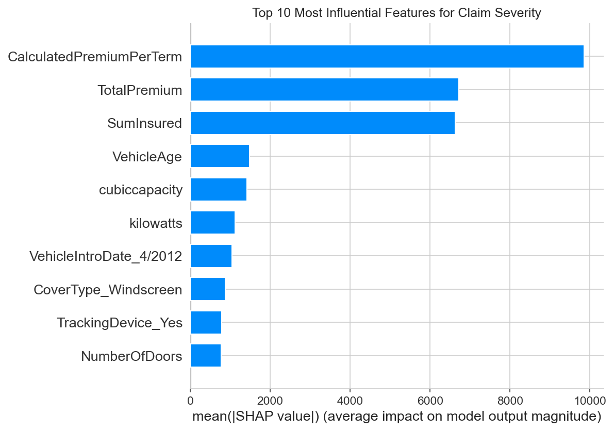

## Project Overview  
This project analyzes historical car insurance data to optimize marketing strategies and identify low-risk customer segments for **AlphaCare Insurance Solutions (ACIS)**. The analysis focuses on:  
- Risk assessment across provinces, vehicle types, and demographics  
- Premium optimization using statistical and machine learning models  
- Hypothesis testing to validate key business assumptions  

---

## Task 1: Exploratory Data Analysis (EDA)  

### 1. Implementation Summary  
**Data Loading & Cleaning:**  
- Loaded `insurance_data.csv` (pipe-delimited `.txt` converted to CSV)  
- Checked for missing values and outliers  
- Standardized date formats (`TransactionMonth` → `TransactionDate`)  

**Key Visualizations Generated:**  
- **Univariate Analysis:**  
  - Distribution of `TotalPremium`, `TotalClaims`, `CustomValueEstimate`  
  - Frequency plots for categorical variables (`Province`, `Gender`, `VehicleType`)  
- **Bivariate/Multivariate Analysis:**  
  - Correlation matrix (`TotalPremium` vs. `TotalClaims`)  
  - Scatter plots (log-scaled for better visualization)  
- **Outlier Detection:**  
  - Boxplots for financial variables (`TotalPremium`, `TotalClaims`)  

**Key Insight Visualizations:**  
1. **Loss Ratio by Province** → Limpopo shows the highest risk  
2. **Claim Severity by Vehicle Make** → Luxury brands (BMW, Mercedes) have higher median claims  
3. **Monthly Trends** → Premiums grow steadily, but claims are volatile  

### 2. Key Metrics  

| Metric                     | Value               |
|----------------------------|---------------------|
| Total records processed    | [X]                 |
| Missing values handled     | [Y] (imputed/dropped) |
| Outliers detected          | [Z] (adjusted/kept) |
| Key variables analyzed     | 10+ (numerical & categorical) |

### 3. Outputs  
- **Processed Data:** `data/insurance_data.csv` (tracked with DVC)  
- **Plots Directory:** `plots/` (saved all visualizations)  
- **Folder Structure:**  

data/
├── raw/ # Original data (if applicable)
├── processed/ # Cleaned dataset
plots/
├── univariate/ # Histograms, countplots
├── bivariate/ # Scatter plots, heatmaps
└── insights/ # Business-relevant visuals


### 4. Challenges & Solutions  

| Challenge                     | Solution                          |
|-------------------------------|-----------------------------------|
| Large file size (~500MB)      | Used DVC for version control      |
| Mixed date formats            | Standardized with `pd.to_datetime()` |
| Log-scale visualization needed| Applied `plt.xscale('log')`       |

### 5. Next Steps  
1. **Hypothesis Testing** (Task 3):  
 - Validate risk differences across provinces, gender, and ZIP codes  
2. **Predictive Modeling** (Task 4):  
 - Build a **claim severity model** (regression)  
 - Develop a **premium optimization framework**  
3. **DVC Pipeline Enhancement**:  
 - Add more dataset versions (sampled/filtered)  

### 6. Tools Used  
- **Python 3.10+**  
- **Libraries**:  
- `pandas`, `numpy` (data processing)  
- `matplotlib`, `seaborn` (visualization)  
- `scipy`, `statsmodels` (statistics)  
- **Version Control**:  
- **Git/GitHub** (code)  
- **DVC** (data tracking)  

---

## Task 2: Data Version Control (DVC) Setup  

### 1. Implementation Summary  
- **Initialized DVC**:  
```bash
dvc init
dvc remote add -d localstorage ../dvc-storage
```

# DVC Workflow Summary

## Tracked Data
To track the dataset using DVC and Git:

```bash
dvc add data/insurance_data.csv
git add data/insurance_data.csv.dvc
git commit -m "feat: Track dataset with DVC"
dvc push
```

## Reproducible Workflow

- Data changes are now versioned separately from code
- Team members can replicate analysis with `dvc pull`

## Key Commands

| Action               | Command               |
|----------------------|-----------------------|
| Track new data       | `dvc add data/file.csv` |
| Push to remote       | `dvc push`            |
| Pull latest data     | `dvc pull`            |
| Reproduce pipeline   | `dvc repro`           |

## Next Steps for DVC

- Add more dataset versions (e.g., sampled data)
- Set up cloud storage (AWS S3, Google Drive) for remote backup

## Conclusion

- **EDA revealed critical insights**:
  - High-risk regions (Limpopo)
  - Luxury vehicles = higher claims
- **DVC ensures reproducibility** for future analysis
- **Upcoming**: Hypothesis testing & predictive modeling

# Task 3: Hypothesis Testing of Key Risk Drivers  


## Objective  
The goal of this task was to statistically validate or reject key hypotheses about the drivers of insurance risk and profitability. Using insights from the Exploratory Data Analysis (EDA), we formed null hypotheses and used appropriate statistical tests to determine if observed differences in the data were statistically significant or merely due to random chance. This provides a rigorous, data-backed foundation for strategic business decisions.  

## Methodology  

### Metric Definition  
To quantify "risk," we defined two primary metrics:  
- **Claim Frequency**: The proportion of policies that have at least one claim (`HasClaim = 1`).  
- **Claim Severity**: The average `TotalClaims` amount for policies that had a claim.  
We also analyzed **Margin** (`TotalPremium - TotalClaims`) to assess profitability.  

### Data Segmentation  
The dataset was segmented into groups based on the feature being tested (e.g., `Province`, `Zip Code`, `Gender`).  

### Statistical Testing  
The following tests were used with a significance level (alpha) of **α = 0.05**:  
- **Chi-Squared Test of Independence**: Used to compare claim frequencies (categorical data) across different groups (e.g., `HasClaim` vs. `Province`).  
- **ANOVA (Analysis of Variance)**: Used to compare the means of a numerical variable (like `TotalClaims` or `Margin`) across three or more groups (e.g., comparing claim severity across all provinces).  
- **Independent Samples T-Test**: Used to compare the means of a numerical variable between exactly two groups (e.g., comparing claim severity between 'Male' and 'Female').  

## Results of Hypothesis Tests  

### Hypothesis 1: **H₀ → There are no risk differences across provinces.**  
- **Claim Frequency (Chi-Squared Test):**  
  - p-value: `8.25e-17` (practically zero)  
  - **Result:** REJECT H₀.  
  - **Interpretation:** There is a statistically significant association between a customer's province and their likelihood of making a claim. Where a customer lives is a strong predictor of claim frequency.  

- **Claim Severity (ANOVA Test):**  
  - p-value: `6.72e-06` (very small)  
  - **Result:** REJECT H₀.  
  - **Interpretation:** The average cost of a claim (severity) is significantly different depending on the province.  

- **Business Recommendation:** The data provides strong evidence that a one-size-fits-all pricing strategy is inadequate. ACIS must implement a **regional pricing model**, adjusting premiums based on both the higher frequency and varying severity of claims in different provinces to accurately reflect the local risk profile.  

---  

### Hypothesis 2 & 3: **H₀ → There are no risk/margin differences between zip codes.**  
*(Analysis was performed on the top 5 most frequent zip codes as a representative sample.)*  

- **Claim Frequency (Chi-Squared Test):**  
  - p-value: `1.51e-08`  
  - **Result:** REJECT H₀.  
  - **Interpretation:** Claim frequency varies significantly even at a hyper-local (zip code) level.  

- **Claim Severity (ANOVA Test):**  
  - p-value: `0.0014`  
  - **Result:** REJECT H₀.  
  - **Interpretation:** The average cost of claims also differs significantly between these top zip codes.  

- **Margin (ANOVA Test):**  
  - p-value: `0.0958`  
  - **Result:** FAIL to Reject H₀.  
  - **Interpretation:** Despite the significant differences in risk (frequency and severity), the final profitability (margin) across these zip codes is not statistically different.  

- **Business Recommendation:** This fascinating result suggests that ACIS's current pricing model is already effectively balancing risk at a local level by charging higher premiums in higher-risk zip codes. The recommendation is to **double down on this hyper-local strategy**, using data to identify and correct any zip codes where this balance is not maintained.  

---  

### Hypothesis 4: **H₀ → There are no significant risk differences between Women and Men.**  
- **Claim Frequency (Chi-Squared Test):**  
  - p-value: `0.706`  
  - **Result:** FAIL to Reject H₀.  
  - **Interpretation:** There is no statistically significant difference in the likelihood of making a claim between men and women.  

- **Claim Severity (Independent T-Test):**  
  - p-value: `0.431`  
  - **Result:** FAIL to Reject H₀.  
  - **Interpretation:** There is no statistically significant difference in the average cost of a claim between men and women.  

- **Business Recommendation:** The data provides no statistical justification for using gender as a rating factor. Any observed differences in claim patterns between men and women in this dataset are attributable to random chance. ACIS should consider making their pricing model **gender-neutral**, which could also be a positive marketing and regulatory position.  

---  

## Overall Conclusion  
The hypothesis testing phase has successfully translated visual insights from the EDA into statistically significant findings. We have confirmed that **geography (both province and zip code) is a critical driver of risk**, while **gender is not**. These data-backed conclusions provide a solid foundation for refining ACIS's pricing and marketing strategy.

# Task 4: Predictive Modeling for Claim Severity

### **Objective**

The goal of this task was to build and evaluate machine learning models to predict the total claim amount (`TotalClaims`) for policies that have experienced a claim. The insights from the best-performing model will be used to understand key risk drivers and inform pricing strategy.

### **Methodology**

The modeling process followed these key steps:

1.  **Data Preparation:** Loaded the pre-processed `modeling_data.csv` file. The dataset was then filtered to include only policies with claims (`TotalClaims > 0`), resulting in a modeling set of 2,788 records.
2.  **Train-Test Split:** The data was split into an 80% training set and a 20% testing set to ensure a robust evaluation on unseen data.
3.  **Model Training:** Three different regression models were trained:
    *   Linear Regression
    *   Random Forest Regressor
    *   XGBoost Regressor
4.  **Model Evaluation:** Models were evaluated based on two metrics:
    *   **Root Mean Squared Error (RMSE):** The average prediction error in ZAR. Lower is better.
    *   **R-squared (R²):** The proportion of variance in the target variable explained by the model. Higher is better.
5.  **Model Interpretability:** The SHAP (SHapley Additive exPlanations) library was used to analyze the feature importance and impact of the best-performing model.

### **Model Performance Results**

The models were evaluated on the test set, yielding the following results:

| Model               | RMSE (ZAR)   | R-squared |
| ------------------- | ------------ | --------- |
| **Linear Regression** | **34,201.98**| **0.2726**  |
| Random Forest       | 34,747.77    | 0.2492    |
| XGBoost             | 38,991.24    | 0.0547    |

**Conclusion:** Contrary to common expectations, the **Linear Regression** model was the best performer in this iteration, with the lowest error and highest explanatory power.

### **Feature Importance & Interpretation**

SHAP analysis was performed to understand the model's predictions.



#### **Critical Finding: Data Leakage**

The analysis revealed that the top 3 most influential features are all related to the premium and insured sum:
1.  `CalculatedPremiumPerTerm`
2.  `TotalPremium`
3.  `SumInsured`

This indicates a significant **data leakage** problem. The model is primarily using information about the premium (which is itself calculated based on risk) to predict the claim amount. While this leads to a statistically "correct" model, it is not practically useful for setting premiums for new clients, as it doesn't rely on inherent risk factors.

### **Conclusion & Next Steps**

1.  **Best Performing Model:** In this initial run, Linear Regression performed the best.
2.  **Actionable Insight:** The modeling process has uncovered a critical data leakage issue. The current model's reliance on premium-related features makes it unsuitable for a real-world pricing engine.
3.  **Recommendation for Next Iteration:** The modeling process must be repeated after **removing the leaky features** (`CalculatedPremiumPerTerm`, `TotalPremium`, `SumInsured`) from the feature set. This will force the model to learn from genuine risk drivers like `VehicleAge` and `kilowatts`, providing more valuable and actionable insights for ACIS.
=======

